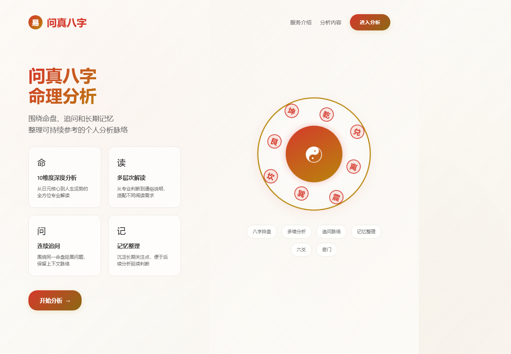
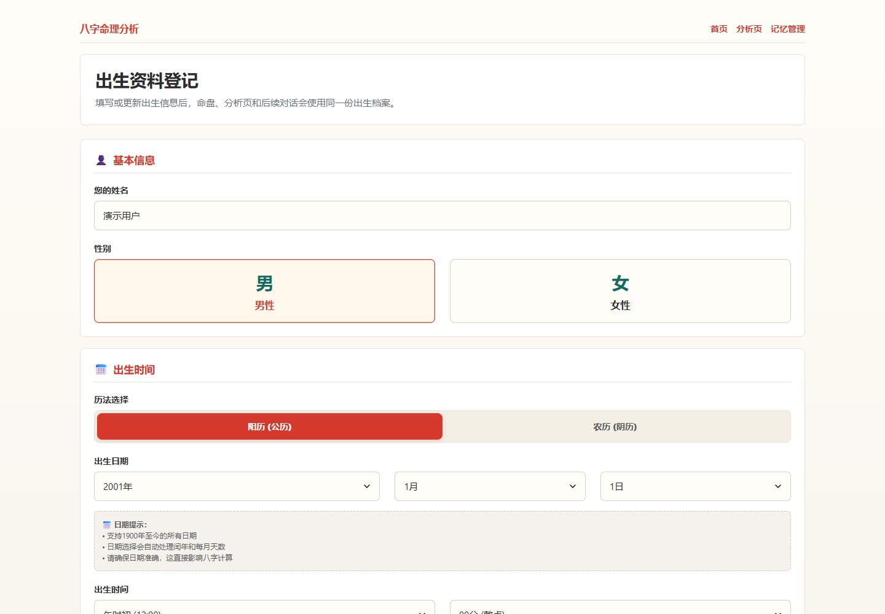
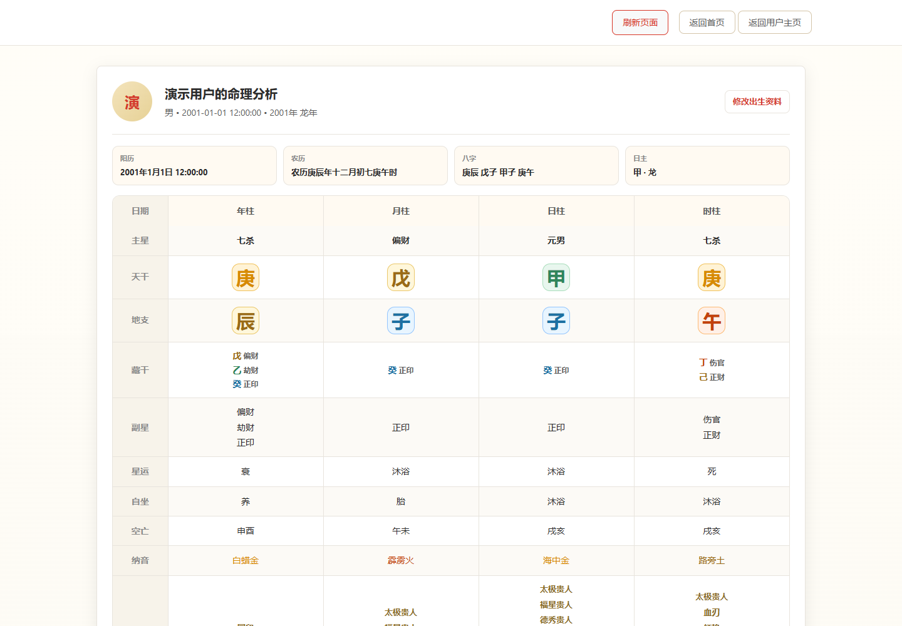
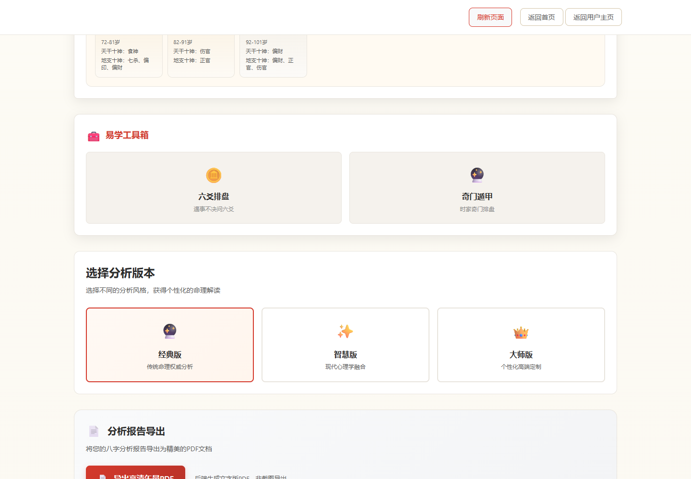
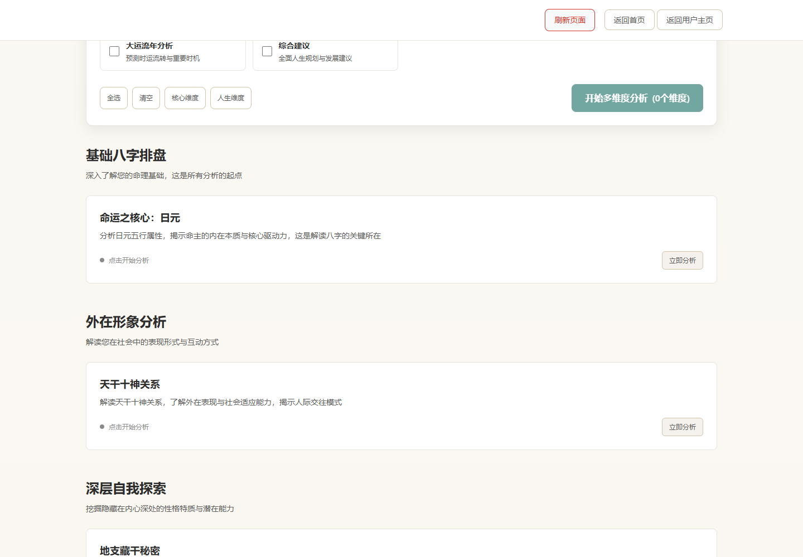
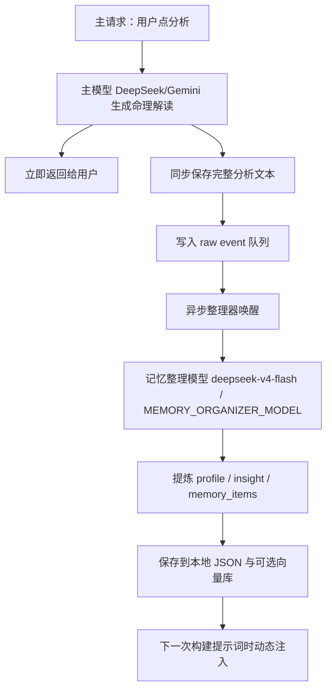
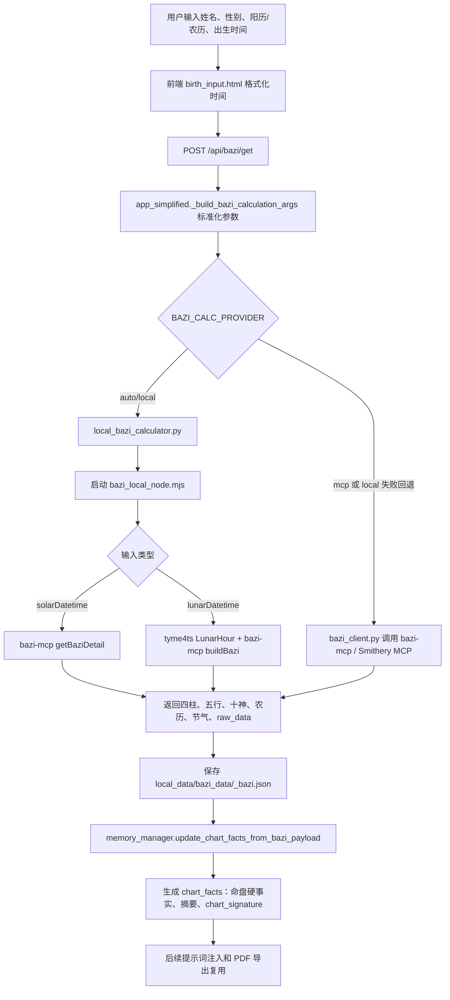
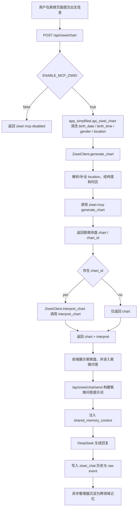
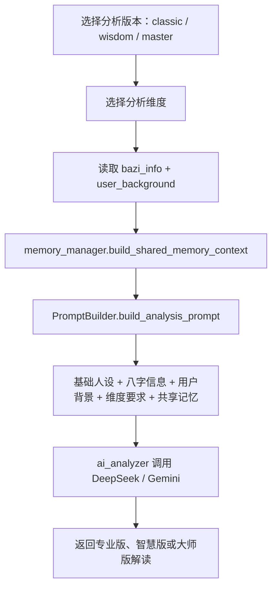

# AI 命理

AI 命理是一个面向自我理解的 AI 命理产品。项目结合了本地八字排盘、紫微斗数排盘、六爻奇门、提示词工程、多模型命理解读，以及分层长期记忆系统。

它的目标不只是生成一次性的命理报告，而是通过结构化命盘事实、多维度分析和逐步沉淀的长期记忆，帮助用户建立更清晰的自我叙事。

## 功能展示

### 首页：命理分析入口

首页突出“八字排盘、多维分析、连续追问、记忆整理”的核心能力，让用户快速理解产品定位并进入分析流程。



### 出生资料登记

用户填写姓名、性别、阳历/农历、出生日期和出生时辰。后续排盘、分析和长期记忆都会围绕这份出生档案展开。



### 八字排盘工作台

提交出生资料后，系统生成基础八字命盘，包括阳历、农历、四柱、日主、藏干、十神、星运、纳音、神煞和大运信息。



### 工具箱、版本选择与报告导出

分析页提供六爻、奇门等扩展工具入口，并支持经典版、智慧版、大师版等不同解读风格，以及 PDF 报告导出能力。



### 多维度 AI 命理解读

用户可以选择日元核心、天干十神、地支藏干、五行生克、事业、感情、健康、大运流年等维度，生成结构化命理解读。



## 核心产品链路

主要用户路径如下：

1. 用户输入个人出生信息。
2. 系统优先在本地计算八字命盘事实。
3. 用户选择一个或多个分析维度。
4. 提示词模板组合命盘事实、用户背景、维度要求和共享记忆。
5. DeepSeek 或 Gemini 生成命理解读。
6. 完整分析结果立即返回给用户。
7. 独立的记忆整理器随后提炼长期用户画像、维度洞察和记忆条目。
8. 后续分析时，系统动态注入最新的记忆上下文。



## 八字排盘计算流程

八字计算采用“本地优先”的链路设计。后端先标准化用户输入，然后优先通过本地 Node 桥接脚本调用排盘能力；如果本地计算失败，且配置允许回退，则调用 MCP 服务链路。



关键文件：

- `birth_input.html`：收集并格式化用户出生信息。
- `app_simplified.py`：提供 `POST /api/bazi/get`，负责参数校验、计算链路选择和命盘数据保存。
- `local_bazi_calculator.py`：Python 侧本地 Node 进程包装器。
- `bazi_local_node.mjs`：本地 Node 桥接脚本，使用 `bazi-mcp` 和 `tyme4ts`。
- `bazi_client.py`：MCP 回退客户端。
- `memory_manager.py`：从八字结果中提取稳定的 `chart_facts`。

## 紫微排盘计算流程

紫微斗数使用独立的 MCP 排盘服务实现，由 `ENABLE_MCP_ZIWEI` 控制开关，并服务于紫微排盘页面和紫微问答链路。



关键文件：

- `ziwei_client.py`：封装 `ziwei-mcp` 工具调用，包括 `generate_chart` 和 `interpret_chart`。
- `app_simplified.py`：提供 `POST /api/ziwei/chart` 和紫微问答接口。
- `analysis-detail.html`：包含紫微前端交互。
- `memory_manager.py`：支持将紫微问答事件整理成带领域识别的共享记忆。

## 提示词与解读流程

提示词构建集中在 `prompt_templates.py` 中。



当前支持的八字分析维度包括：

- 日元核心分析
- 天干十神分析
- 地支藏干分析
- 五行生克分析
- 用神忌神分析
- 事业运势分析
- 感情婚姻分析
- 健康状况分析
- 大运流年分析
- 综合建议

## 记忆系统

记忆系统采用本地优先的分层设计。它不会把所有历史记录无差别塞进提示词，而是根据任务、维度、用户偏好和上下文预算，动态注入经过筛选的记忆。

主要记忆层包括：

- `chart_facts`：从八字排盘结果中提取的稳定命盘事实。
- `profile`：用户背景、偏好、标签和反馈。
- `insights`：按分析维度和版本沉淀的长期结论。
- `memory_items`：可管理的记忆条目，包括领域洞察、支持型画像和片段事件。
- `events`：异步整理器消费的原始事件队列。
- 可选向量记忆：当 `ENABLE_VECTOR_MEMORY=true` 时，用于补充语义检索。

异步整理器由 `ENABLE_ASYNC_ORGANIZER=true` 启用。主请求会先写入 raw event 并立即返回给用户，整理器随后使用 `MEMORY_ORGANIZER_MODEL` 生成结构化记忆补丁。这形成了一个“最终一致”的记忆循环：当前回答保持快速，下一次分析则可以受益于刚刚整理出的长期记忆。

## 数据安全边界

仓库刻意排除了运行时密钥和用户数据：

- `.env`
- `local_data/`
- `user_data/`
- `manual_exports/`
- 日志文件
- 生成的 PDF 报告
- Python 虚拟环境
- `node_modules/`

请使用 `env.template` 作为环境变量参考，真实 API Key 不应进入 Git。

## 本地运行

```powershell
python -m venv .venv
.\.venv\Scripts\pip.exe install -r requirements.txt
npm install
copy env.template .env
.\.venv\Scripts\python.exe app_simplified.py
```

运行 AI 功能前，需要在 `.env` 中配置对应模型和服务的 API Key。

## 许可证

本项目采用 Apache License 2.0 开源许可证。相比 MIT，Apache 2.0 增加了更明确的专利授权、修改声明和再分发要求。
