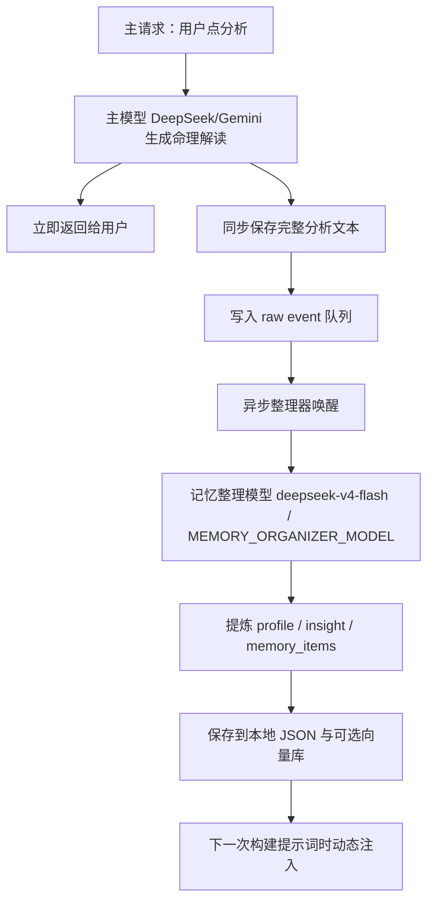
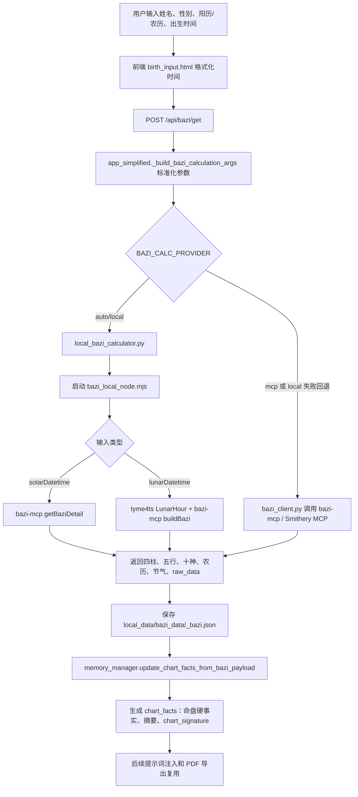
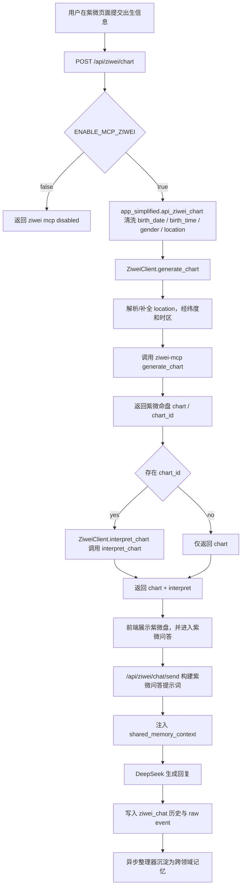
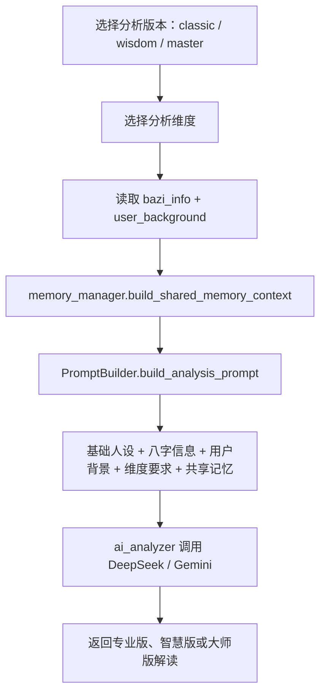

# AI MingLi

AI MingLi is an AI-assisted Chinese metaphysics product for self-understanding. It combines local BaZi chart calculation, Ziwei chart generation, prompt engineering, multi-model interpretation, and a layered long-term memory system.

The product goal is not only to produce a one-off fortune reading, but to help users build a clearer personal narrative through structured chart facts, repeated analysis, and gradually refined memory.

## Core Product Loop

The main user journey is:

1. User enters personal birth information.
2. The system calculates BaZi chart facts locally when possible.
3. The user selects one or more analysis dimensions.
4. Prompt templates combine chart facts, user background, dimension instructions, and shared memory.
5. DeepSeek or Gemini generates the interpretation.
6. The full analysis is returned immediately.
7. A separate memory organizer later extracts durable profile, insight, and memory items.
8. Future prompts dynamically inject the latest memory context.



## BaZi Calculation Flow

BaZi calculation is designed as a local-first pipeline. The backend normalizes user input and prefers the local Node bridge. If local calculation fails and the provider mode allows fallback, it calls the MCP-based provider.



Key files:

- `birth_input.html`: collects and formats birth information.
- `app_simplified.py`: exposes `POST /api/bazi/get`, validates input, chooses provider, saves user chart data.
- `local_bazi_calculator.py`: Python wrapper around the local Node process.
- `bazi_local_node.mjs`: local Node bridge using `bazi-mcp` and `tyme4ts`.
- `bazi_client.py`: MCP fallback client.
- `memory_manager.py`: extracts stable `chart_facts` from BaZi payloads.

## Ziwei Calculation Flow

Ziwei is implemented as a separate MCP-backed chart service. It is gated by `ENABLE_MCP_ZIWEI`, then used by the Ziwei page and chat workflow.



Key files:

- `ziwei_client.py`: wraps `ziwei-mcp` tool calls, including `generate_chart` and `interpret_chart`.
- `app_simplified.py`: exposes `POST /api/ziwei/chart` and Ziwei chat APIs.
- `analysis-detail.html`: contains Ziwei frontend interactions.
- `memory_manager.py`: Ziwei chat events can be organized into shared memory with domain awareness.

## Prompt and Interpretation Flow

Prompt construction is centralized in `prompt_templates.py`.



Supported BaZi dimensions include:

- 日元核心分析
- 天干十神分析
- 地支藏干分析
- 五行生克分析
- 用神忌神分析
- 事业运势分析
- 感情婚姻分析
- 健康状况分析
- 大运流年分析
- 综合建议

## Memory System

The memory system is a layered local-first design. It avoids putting all history into the prompt and instead injects a bounded, filtered context.

Main memory layers:

- `chart_facts`: stable chart facts extracted from BaZi payloads.
- `profile`: user background, preferences, tags, and feedback.
- `insights`: durable conclusions by analysis dimension and version.
- `memory_items`: manageable memory records such as domain insights, support profile items, and episodes.
- `events`: raw event queue consumed by the async organizer.
- optional vector memory: semantic supplement when `ENABLE_VECTOR_MEMORY=true`.

The async organizer is enabled by `ENABLE_ASYNC_ORGANIZER=true`. The main request writes a raw event and returns to the user first. The organizer later uses `MEMORY_ORGANIZER_MODEL` to produce structured memory patches. This creates an eventually consistent memory loop: the current response is fast, and the next response can benefit from newly organized memory.

## Data Safety Boundary

The repository intentionally excludes runtime secrets and user data:

- `.env`
- `local_data/`
- `user_data/`
- `manual_exports/`
- logs
- generated PDFs
- virtual environments
- `node_modules/`

Use `env.template` as the environment variable reference and keep real API keys outside Git.

## Run Locally

```powershell
python -m venv .venv
.\.venv\Scripts\pip.exe install -r requirements.txt
npm install
copy env.template .env
.\.venv\Scripts\python.exe app_simplified.py
```

Before running AI features, configure the required provider keys in `.env`.

